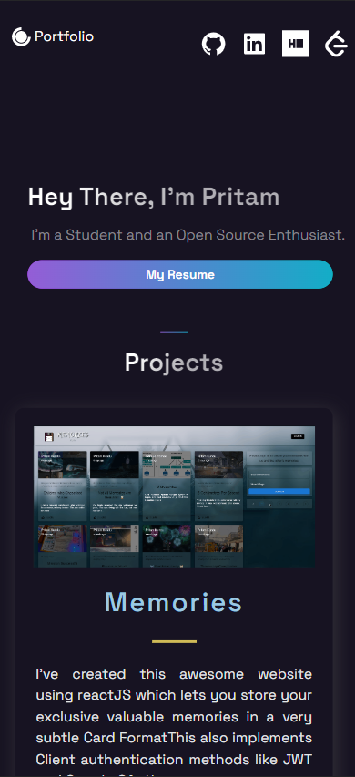

    updated: Tuesday, 21st June 2022

    
    
 Made with NextJS 

    

# [Personal Portfolio](https://portfolio-pritam.netlify.app)

## What's new?

-   Added Projects
-   Fixed CSS for Mobile View
-   Updated Achievements

## Table of Contents
-   [Introduction](#introduction)
-   [Featues](#features)
-   [Tech Stack Used](#tech-stack-used)
-   [Previews](#previews)
-   [License](#license)

---

## Introduction

-   My earlier Portfolio was just a basic HTML-CSS-Javascript bsed website.
-   That was made in just a day for a web developement contest.
-   This is a more refined mature Portfolio built with ReactJS.

---

## Features

- Minimalist Webpage Design
- Contains Card Style Projects 
- Background Animations
- Fully responsive on all devices

## Tech Stack Used

-   Styled Components & React Icons : Styling & Icons
-   React: FrontEnd Developement
-   Netlify: For hosting the frontEnd

---

## Previews

- Desktop Preview
    

-   Mobile Preview  
    

---

## License

-   see [LICENSE]

**Pritam, 2022**  

[license]: https://github.com/warmachine028/portfolio/blob/main/LICENSE
